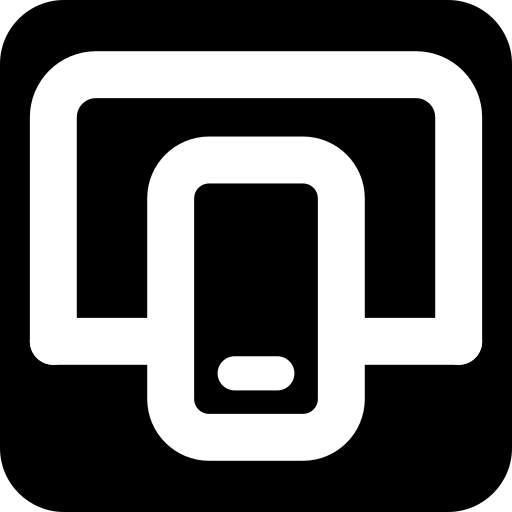
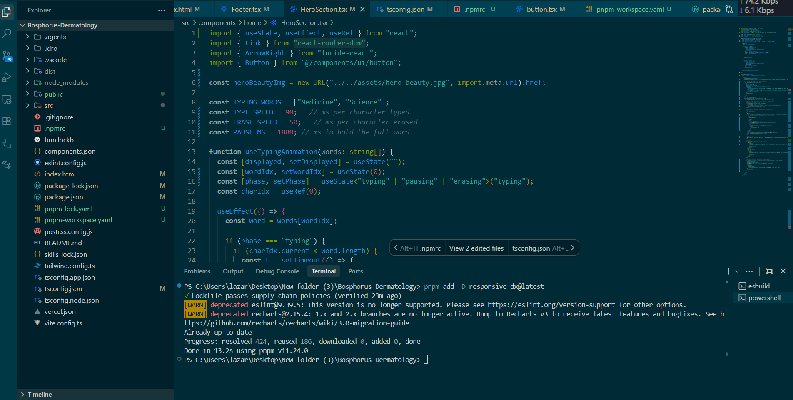

<div align="center">
  <picture>
    <source media="(prefers-color-scheme: dark)" srcset="./assets/logo-dark.svg">
    
  </picture>

  <h1>RESPO . DX</h1>
  <p><strong>Zero-config in-browser responsive workbench suite for localhost.</strong></p>
  <p>Simultaneously test mobile, tablet, and desktop layouts with direct DOM event mirroring, live theme sync, and hardware chassis.</p>

  <p>
    <a href="https://www.npmjs.com/package/responsive-dx"></a>
    <a href="https://www.npmjs.com/package/responsive-dx"></a>
    <a href="https://bundlephobia.com/package/responsive-dx"></a>
    <a href="https://github.com/facebook/react"></a>
    <a href="https://www.typescriptlang.org/"></a>
    <a href="LICENSE"></a>
  </p>

  <br />

  
</div>

<br />

---

## ⚡ Why Not Chrome DevTools?

Every web developer uses Chrome DevTools, but testing responsive UX has remained painfully repetitive:

| Feature | Chrome DevTools | Respo (`responsive-dx`) |
| :--- | :--- | :--- |
| **Multi-Device View** | ❌ 1 viewport at a time | ✅ **Mobile, Tablet & Desktop side-by-side** |
| **Scroll Sync** | ❌ None | ✅ **Zero-latency DOM scroll mirroring across all frames** |
| **Click & Navigation Sync**| ❌ None | ✅ **Click links, buttons, and menus in sync** |
| **Form Input Mirroring** | ❌ Retype on every screen | ✅ **Type inputs, toggles, & selects in real time** |
| **Dark / Light Theme Sync**| ❌ Manual toggle per tab | ✅ **Reactive auto-sync with system & in-app themes** |
| **Single-View Focus** | ❌ Rescale entire window | ✅ **Instant 1-click zoom (`[ ⛶ FOCUS ]`) + Esc to reset** |
| **Dependencies & Bloat** | ⚠️ Complex emulators | ✅ **0 Dependencies, 0 Security Warnings** |
| **Team DX Standardization** | ❌ Every dev configures own emulators | ✅ **Standardized via your repo's `devDependencies`** |
| **Hardware Bezels** | ⚠️ Flat gray box | ✅ **Realistic iPhone notch & macOS chassis** |

---

## ✨ Features

- 🛡️ **Zero Runtime Dependencies**: Has **0 external sub-dependencies**, zero install scripts, and zero security vulnerabilities. Ultra-lightweight and installs in under 1 second.
- 🚀 **Direct DOM Event Mirroring**: Real-time scroll, click, and form input synchronization without browser extension overhead, proxy servers, or `postMessage` lag.
- 🌓 **Dynamic Theme Synchronization**: Seamlessly detects `prefers-color-scheme`, `data-theme`, and Tailwind `class="dark"` mutations on `document.documentElement` and mirrors them across all viewports.
- 🔍 **Single-View Zoom & Center**: Hit `[ ⛶ FOCUS ]` on any viewport to immediately center and zoom that device to 100% full view with ambient depth blur on background frames. Press `Escape` to return to multi-view.
- 🛡️ **Shadow DOM Isolation**: All studio styles, top command dock, and chassis elements adopt CSS directly inside an isolated Shadow Root — **zero style leakage or CSS clashes** with your host application.
- 🌲 **Zero Production Footprint**: Evaluates to `null` when `process.env.NODE_ENV !== 'development'`. Modern bundlers (Webpack, Vite, Turbopack, Rollup) automatically tree-shake the entire package out of production builds.

---

## 🚀 Quick Start

### ⚡ Option A: 1-Command Automated Setup (Recommended)

Run inside any React, Next.js, Vite, Remix, or Astro project:

```bash
npx responsive-dx init
```

*Detects your framework, installs `responsive-dx` as a devDependency, and automatically injects `<ResponsiveDX />` into your root layout.*

---

### 🛠️ Option B: Manual Setup

#### 1. Install package

```bash
# pnpm
pnpm add -D responsive-dx

# npm
npm install -D responsive-dx

# yarn
yarn add -D responsive-dx

# bun
bun add -d responsive-dx
```

#### 2. Add to your Root Layout

**Next.js App Router (`app/layout.tsx`)**
```tsx
import { ResponsiveDX } from 'responsive-dx';

export default function RootLayout({ children }: { children: React.ReactNode }) {
  return (
    <html lang="en">
      <body>
        {children}
        <ResponsiveDX />
      </body>
    </html>
  );
}
```

**Next.js Pages Router (`pages/_app.tsx`)**
```tsx
import type { AppProps } from 'next/app';
import { ResponsiveDX } from 'responsive-dx';

export default function App({ Component, pageProps }: AppProps) {
  return (
    <>
      <Component {...pageProps} />
      <ResponsiveDX />
    </>
  );
}
```

**Vite + React (`src/main.tsx` / `src/App.tsx`)**
```tsx
import React from 'react';
import ReactDOM from 'react-dom/client';
import { ResponsiveDX } from 'responsive-dx';
import App from './App';

ReactDOM.createRoot(document.getElementById('root')!).render(
  <React.StrictMode>
    <App />
    <ResponsiveDX />
  </React.StrictMode>
);
```

**Remix / React Router v7 (`app/root.tsx`)**
```tsx
import { ResponsiveDX } from 'responsive-dx';

export default function Root() {
  return (
    <Document>
      <Outlet />
      <ResponsiveDX />
    </Document>
  );
}
```

**Astro (`src/layouts/Layout.astro`)**
```astro
---
import { ResponsiveDX } from 'responsive-dx';
---
<html lang="en">
  <body>
    <slot />
    <ResponsiveDX client:only="react" />
  </body>
</html>
```

---

## ⚙️ Props & Configuration

| Prop | Type | Default | Description |
| :--- | :--- | :--- | :--- |
| `src` | `string` | `window.location.href` | Target URL loaded in the viewport iframes. |
| `defaultViewports` | `string[]` | `['mobile-375', 'tablet-768', 'desktop-1440']` | IDs of initially active viewports. |

```tsx
<ResponsiveDX
  src="http://localhost:3000"
  defaultViewports={['mobile-375', 'desktop-1440']}
/>
```

---

## 📐 Built-in Viewport Presets

| Preset ID | Device Type | Logical Resolution | Description |
| :--- | :--- | :--- | :--- |
| `mobile-375` | Mobile | 375 × 812 px | Modern mobile layout (iPhone-grade viewport) |
| `tablet-768` | Tablet | 768 × 1024 px | Portrait tablet layout (iPad-grade viewport) |
| `desktop-1440` | Desktop | 1440 × 900 px | Standard wide desktop layout with Mac header |

---

## 🧠 Architecture & How It Works

```
                     ┌──────────────────────────────────────────────┐
                     │            Host Application (DOM)           │
                     └──────────────────────┬───────────────────────┘
                                            │
                                  <ResponsiveDX />
                                            │
                               ┌────────────▼────────────┐
                               │  Shadow DOM Root       │
                               │  (Complete Isolation)  │
                               └────────────┬────────────┘
                                            │
               ┌────────────────────────────┼────────────────────────────┐
               │                            │                            │
      ┌────────▼────────┐          ┌────────▼────────┐          ┌────────▼────────┐
      │  Mobile Frame   │ ◄──────► │  Tablet Frame   │ ◄──────► │ Desktop Frame   │
      │   (375 × 812)   │  Mutual  │  (768 × 1024)   │  Mutual  │  (1440 × 900)   │
      └─────────────────┘  Excl.   └─────────────────┘  Excl.   └─────────────────┘
                ▲                    Event Mutex                  ▲
                └────────────────── Live DOM Mirror ──────────────┘
```

1. **Same-Origin Direct DOM Access**: Because all viewport iframes point to `localhost`, Respo accesses `contentWindow.document` directly without `postMessage` serializing overhead.
2. **Mutual Exclusion Event Mutex**: When scrolling or typing in one viewport, an internal mutex lock temporarily prevents child-to-parent-to-child event feedback loops.
3. **Browsing Context Recursion Guard**: An internal SSR and iframe guard (`isTopFrame()`) guarantees that nested iframes inside the studio never recursively mount instances of the widget.

---

## 🛡️ Troubleshooting & Security Headers (Next.js)

If your app uses strict custom headers (e.g. `X-Frame-Options: DENY`), browsers will block local `<iframe>` previews.

### Automatic Fix (CLI)
Running `npx responsive-dx init` will automatically detect and configure this for you.

### Manual Fix
In your `middleware.ts` or `next.config.js`, ensure `X-Frame-Options` is set to `SAMEORIGIN` during development:

```ts
// middleware.ts
import { NextResponse } from 'next/server';

export function middleware() {
  const response = NextResponse.next();
  // Allow localhost to embed iframes for responsive testing
  response.headers.set('X-Frame-Options', 'SAMEORIGIN');
  return response;
}
```

---

## 🤝 Contributing

Contributions, issues, and feature requests are welcome! Feel free to check out the [Issues](https://github.com) page.

1. Fork the project
2. Create your feature branch (`git checkout -b feature/amazing-feature`)
3. Commit your changes (`git commit -m 'feat: add amazing feature'`)
4. Push to the branch (`git push origin feature/amazing-feature`)
5. Open a Pull Request

---

## 📄 License

Distributed under the MIT License. See [LICENSE](LICENSE) for details.
